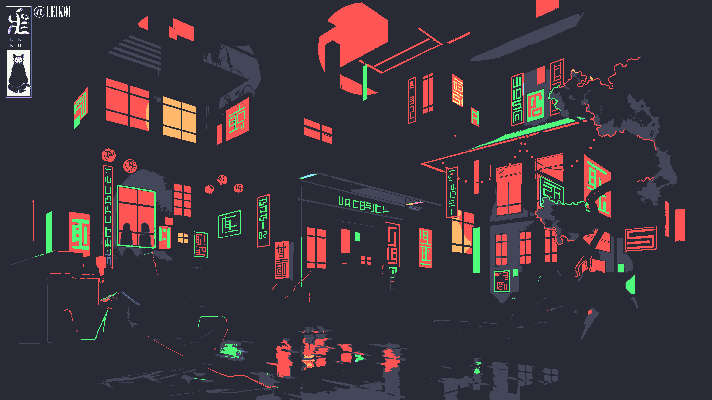
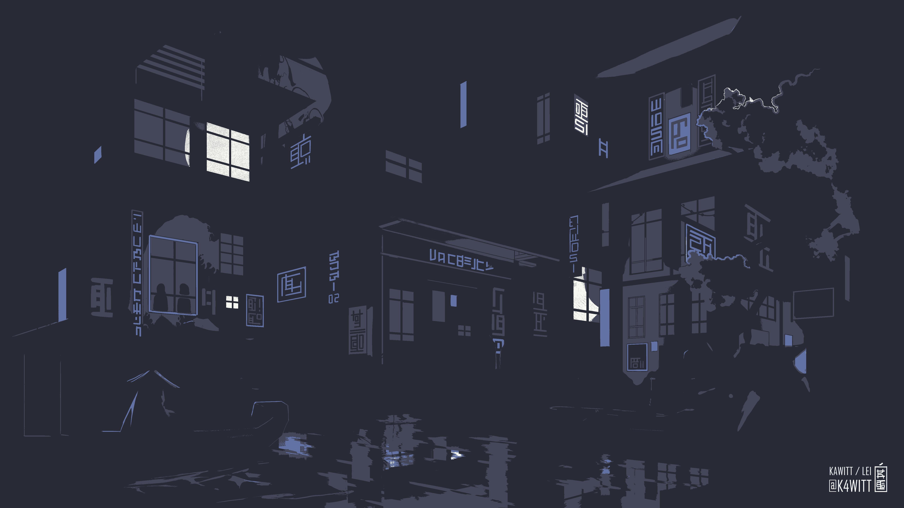
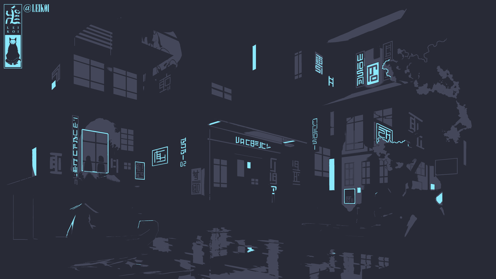
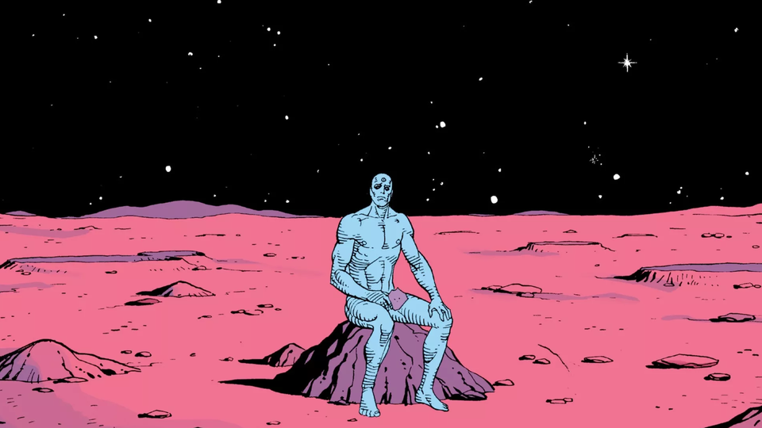
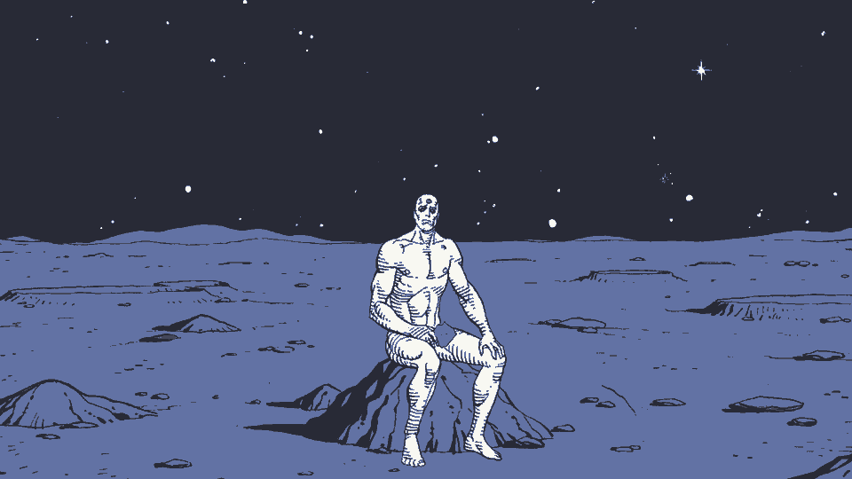
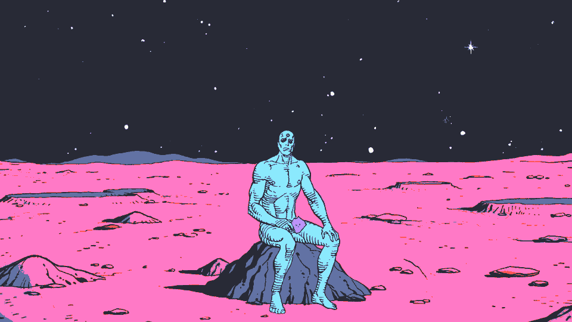

# ImageGoNord-dracula

> _"A dark theme for many editors, shells, and more ... when you're "in the zone", then suddenly, you get distracted and lose focus. It shouldn't be that way, so I decided to create my own color scheme, and my mission was to make it available everywhere."_ -- [Zeno Rocha](https://draculatheme.com/about)

This is a palette add-on for the [ImageGoNord](https://github.com/Schrodinger-Hat/ImageGoNord) cli based on the [Dracula](https://github.com/dracula) dark theme colors.

---

## Usage

For now, one must manually copy the [`./palettes/dracula-nonpro`](./palettes/dracula-nonpro) folder into their local ImageGoNord's [palette](https://github.com/Schrodinger-Hat/ImageGoNord/tree/master/src/palettes) folder.

```
tree ImageGoNord/src/palettes

src/palettes
├── Nord
│   ├── ...
│   └── ...
└── dracula-nonpro
    ├── Background.txt
    ├── ...
    └── Yellow.txt
```

   * Current WIP [issue](https://github.com/Schrodinger-Hat/ImageGoNord/issues/45) that may make this process easier in the future.

Once the Dracula palette folder is copied, you can simply run the ImageGoNord tool, and specify the Dracula palette:

```bash
# all colors
python src/cli.py --dracula-nonpro ...
```

Per standard ImageGoNord CLI args, you can further specify specific palette color options by adding on the names of specific groups in the palette to enable (by default, all are):


```bash
# "dark" colors
python src/cli.py --dracula-nonpro=Background,CurrentLine,Comment,Foreground ...

# background, green, pink
python src/cli.py --dracula-nonpro=Background,Green,Pink ...

# etc...
```

## Examples

Just a few examples of generated images using this palette; generate many more of your own using the appropriate CLI arguments of the ImageGoNord tool, and supplying your own source images.

### [Neon Shallows](https://www.deviantart.com/leikoi/art/The-Neon-Shallows-823330548)

> It isn't a wallpaper example dump without some flavor of Neon Shallows..... LEIKOI is goated for this one.

* All colors:

    ```bash
    python src/cli.py --dracula-nonpro --img=neon_shallows.png --out=neon_shallows_dracula.png
    ```

    Before                     |  After
    :-------------------------:|:-------------------------:
       |  


* "Dark" colors:


    ```bash
    python src/cli.py --dracula-nonpro=Background,CurrentLine,Comment,Foreground --img=neon_shallows.png --out=neon_shallows_dracula.png
    ```

    Before                     |  After
    :-------------------------:|:-------------------------:
       |  

* BG + current line + cyan:

    ```bash
    python src/cli.py --dracula-nonpro=Background,CurrentLine,Cyan ...
    ```

    Before                     |  After
    :-------------------------:|:-------------------------:
       |  


### [Godzilla](https://www.reddit.com/r/ImageGoNord/comments/n6dvek/3300x1856_my_current_wallpaper_and_for_godzilla/)

* All colors:

    ```bash
    python src/cli.py --dracula-nonpro ...
    ```

    Before                     |  After
    :-------------------------:|:-------------------------:
       |  

* BG + cyan + purple + pink:

    ```bash
    python src/cli.py --dracula-nonpro=Background,Cyan,Purple,Pink ...
    ```

    Before                     |  After
    :-------------------------:|:-------------------------:
       |  

* BG + current line + purple + pink + green + cyan

    ```bash
    python src/cli.py --dracula-nonpro=Background,CurrentLine,Purple,Pink,Green,Cyan ...
    ```

    Before                     |  After
    :-------------------------:|:-------------------------:
       |  


### [Morgan Codes](https://www.reddit.com/r/MinimalWallpaper/comments/gbm5dk/morgan_codes_3840x2160/)

* All colors:

    ```bash
    python src/cli.py --dracula-nonpro --img=morgan_codes.png --out=morgan_codes_dracula.png
    ```

    Before                     |  After
    :-------------------------:|:-------------------------:
       |  

* "Dark" colors:

    ```bash
    python src/cli.py --dracula-nonpro=Background,CurrentLine,Comment --img=morgan_codes.png --out=morgan_codes_dracula_dark.png
    ```
    
    Before                     |  After
    :-------------------------:|:-------------------------:
       |  

* Background + highlights:

    ```bash
    python src/cli.py --dracula-nonpro=Background,Cyan,Green,Orange,Pink,Purple,Red,Yellow  ...
    ```

    Before                     |  After
    :-------------------------:|:-------------------------:
       |  

* Background + Current Line:
    
    ```bash
    python src/cli.py --dracula-nonpro=Background,CurrentLine  ...
    ```

    Before                     |  After
    :-------------------------:|:-------------------------:
       |  


### [Dr. Manhattan on Mars](https://www.reddit.com/r/wallpapers/comments/jycuni/dr_manhattan_sitting_on_mars_1920x1080/)

* "Dark" colors:

    ```bash
    python src/cli.py --dracula-nonpro=Background,CurrentLine,Comment,Foreground ...
    ```

    Before                     |  After
    :-------------------------:|:-------------------------:
       |  

* All colors:

    ```bash
    python src/cli.py --dracula-nonpro ...
    ```

    Before                     |  After
    :-------------------------:|:-------------------------:
       |  


### [Google Dots](https://www.reddit.com/r/google/comments/4bydwp/quick_wallpaper_i_made_of_the_google_dots/)

* "Dark" colors:

    ```bash
    python src/cli.py --dracula-nonpro=Background,CurrentLine,Comment,Foreground --img=google_dots.png --out=google_dots_dracula.png
    ```

    Before                     |  After
    :-------------------------:|:-------------------------:
         |  


