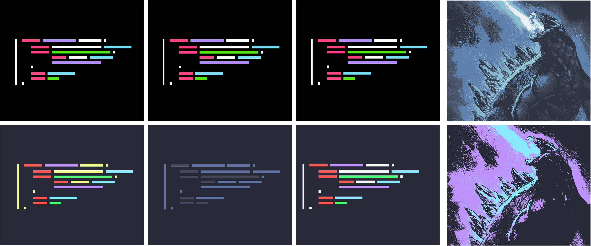

# Dracula for [ImageGoNord](https://github.com/Schrodinger-Hat/ImageGoNord)

> A dark theme for [ImageGoNord](https://ign.schrodinger-hat.it/)

Original image in top row, altered image on the bottom row (source credits in Github repo); more examples in the INSTALL section.

## Install

All instructions can be found at [draculatheme.com/imagegonord-dracula](https://draculatheme.com/imagegonord-dracula).

## Team

This theme is maintained by the following person(s) and a bunch of [awesome contributors](https://github.com/dracula/em-client/graphs/contributors).

|  |
| --- |
| [George Pickering](https://github.com/bigpick) |

## License

[MIT License](./LICENSE)

