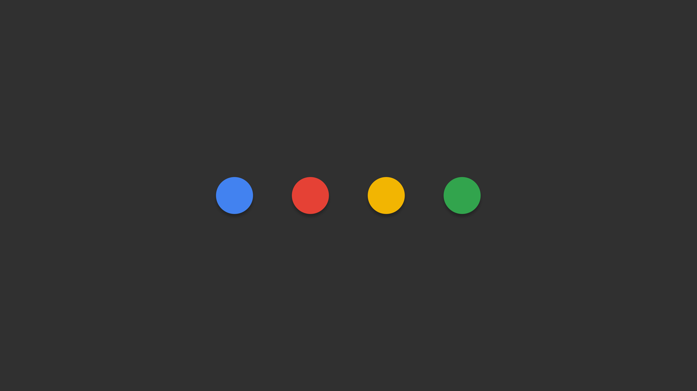
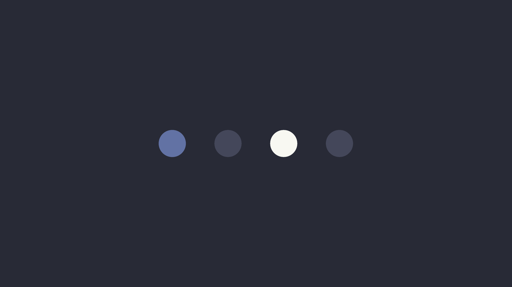

# ImageGoNord-dracula

> _"A dark theme for many editors, shells, and more ... when you're "in the zone", then suddenly, you get distracted and lose focus. It shouldn't be that way, so I decided to create my own color scheme, and my mission was to make it available everywhere."_
>
> - [Zeno Rocha - Dracula founder](https://draculatheme.com/about)

This is a palette add-on for the [ImageGoNord](https://github.com/Schrodinger-Hat/ImageGoNord) cli based on the [Dracula](https://github.com/dracula) dark theme.


---

## Examples

Some examples of generated images using this palette.


### [Neon Shallows](https://www.deviantart.com/leikoi/art/The-Neon-Shallows-823330548)

> It isn't a wallpaper example dump without some flavor of Neon Shallows..... LEIKOI is goated for this one.

* All colors:

    ```bash
    python src/cli.py --dracula-nonpro --img=neon_shallows.png --out=neon_shallows_dracula.png
    ```

    Before                     |  After
    :-------------------------:|:-------------------------:
       |  


* "Dark" colors:


    ```bash
    python src/cli.py --dracula-nonpro=Background,CurrentLine,Comment,Foreground --img=neon_shallows.png --out=neon_shallows_dracula.png
    ```

    Before                     |  After
    :-------------------------:|:-------------------------:
       |  


### [Morgan Codes](https://www.reddit.com/r/MinimalWallpaper/comments/gbm5dk/morgan_codes_3840x2160/)

* All colors:

    ```bash
    python src/cli.py --dracula-nonpro --img=morgan_codes.png --out=morgan_codes_dracula.png
    ```

    Before                     |  After
    :-------------------------:|:-------------------------:
       |  

* "Dark" colors:

    ```bash
    python src/cli.py --dracula-nonpro=Background,CurrentLine,Comment --img=morgan_codes.png --out=morgan_codes_dracula_dark.png
    ```
    
    Before                     |  After
    :-------------------------:|:-------------------------:
       |  

* Background + highlights:

    ```bash
    python src/cli.py --dracula-nonpro=Background,Cyan,Green,Orange,Pink,Purple,Red,Yellow  ...
    ```

    Before                     |  After
    :-------------------------:|:-------------------------:
       |  

* Background + Current Line:
    
    ```bash
    python src/cli.py --dracula-nonpro=Background,CurrentLine  ...
    ```

    Before                     |  After
    :-------------------------:|:-------------------------:
       |  


### [Dr. Manhattan on Mars](https://www.reddit.com/r/wallpapers/comments/jycuni/dr_manhattan_sitting_on_mars_1920x1080/)

* "Dark" colors:

    ```bash
    python src/cli.py --dracula-nonpro=Background,CurrentLine,Comment,Foreground ...
    ```

    Before                     |  After
    :-------------------------:|:-------------------------:
       |  

* All colors:

    ```bash
    python src/cli.py --dracula-nonpro ...
    ```

    Before                     |  After
    :-------------------------:|:-------------------------:
       |  


### [Google Dots](https://www.reddit.com/r/google/comments/4bydwp/quick_wallpaper_i_made_of_the_google_dots/)

* "Dark" colors:

    ```bash
    python src/cli.py --dracula-nonpro=Background,CurrentLine,Comment,Foreground --img=google_dots.png --out=google_dots_dracula.png
    ```

    Before                     |  After
    :-------------------------:|:-------------------------:
         |  


